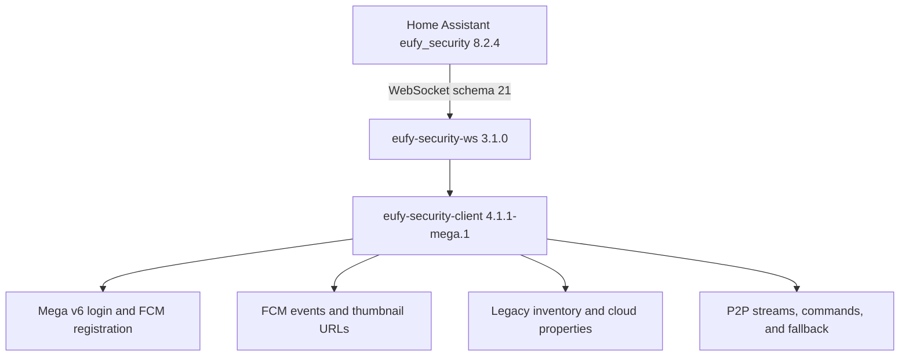

# Architecture and patch notes

Provider ownership is normative in [MIGRATION.md](MIGRATION.md) and machine-readable in
`eufy-mega-ws/vendor/eufy-security-client/src/http/cloudCapabilities.ts`.

## Data flow

The WebSocket server source is deliberately unmodified. Home Assistant therefore sees the exact
server, command, event, property, and schema behavior it already expects. The custom client package
replaces the server's nested client dependency during the image build.

## Changes from client 4.1.1

### Mega identity recovery

`MegaHTTPApi.callWithIdentity()` wraps signed v6 calls. If a restored ECDH identity is rejected with
`CODE_NEED_NEGOTIATE_KEY` (`4404`) or `CODE_SIGNATURE_ERROR` (`4416`), the existing rejection path
evicts it, a new key exchange runs, and the original call is replayed exactly once with a new
timestamp, nonce, and signature. A second rejection is returned without looping.

After successful FCM registration, `MegaTransition` persists the potentially refreshed identity.

### Push-event snapshots

`HTTPApi.getImage()` now makes three bounded attempts. Eufy's push can precede S3 object visibility;
the retry waits are 1 and 3 seconds. A successful body still passes through upstream's
async `v2_eufysecurity:` decoder before the `picture` property is emitted to Home Assistant.

Final error logging removes the presigned query string from the URL.

### Last-image cache

When `snapshotCache` is enabled, valid event-image bytes are atomically written with restrictive
permissions under `/data/snapshots`. JPEG, PNG, and WebP files are recognized by magic bytes and
restored to a camera's `picture` property during device creation. Files larger than 10 MiB and
unknown formats are ignored.

### Native inventory diagnostic

After a successful Mega login, the add-on makes one read-only `house/get_devs_list` request using
the official app body (`house_id`, `categories`, `add_pns`). Only counts, model families,
categories, and parameter-type aggregates are logged. Names, serials, account/member fields,
network addresses, device/P2P keys, and parameter values never enter the diagnostic result.

This diagnostic does not hydrate schema-21 entities and does not change provider ownership:
production inventory remains legacy until native records, special-accessory category discovery,
and command semantics are fully mapped and tested.

## Reproducibility

- Vendored base: `eufy-security-client` tag 4.1.1, commit `12c0933`.
- Server base: `eufy-security-ws` tag 3.1.0, commit `e470932`.
- The Docker build compiles both vendored TypeScript projects, prunes the server to its locked runtime
  dependencies, and verifies the schema version and patch markers in emitted JavaScript.
- CI runs the client Jest suite, TypeScript build, shell syntax checks, YAML parsing, and an amd64
  container build.

## Known limitations

- There is no public, complete Mega v6 inventory/control implementation to vendor as of this build.
- Accounts already returning an empty legacy inventory cannot expose devices through schema 21.
- Push delivery remains dependent on Eufy's registration service and Google's FCM transport.
- Device-specific event mappings remain those supported by client 4.1.1.

## Baiamonte migration safeguard

CI verifies that the known legacy cloud domain remains isolated to the legacy HTTP adapter. The
startup log prints the current provider for every capability group. This makes hybrid operation
explicit today and lets native Mega adapters replace capabilities behind the unchanged schema-21
WebSocket contract later.
